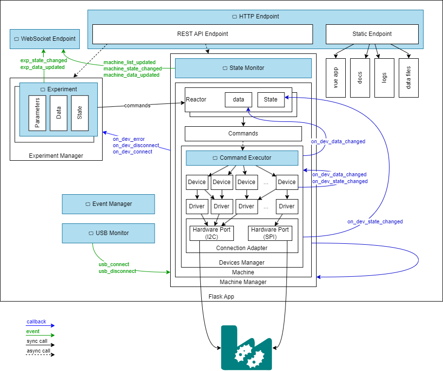

# Processes



## 1. Connect machine

### 1.1. Get connection options

HTTP GET /connection <- JSON from MachineManager:

```json
{
    "current": {},
    "options": {}
}
```

### 1.2. Connect

HTTP POST /connection data:

```json
{
    "command": "connect",
    "data": {
        "device_id": ""
    }
}
```

response: NO_CONTENT

### 1.3. Update machine state

WebSocket server emit:

